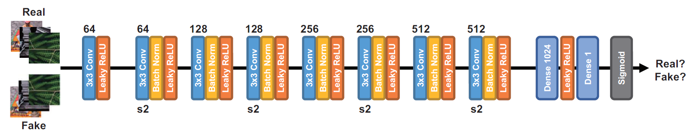
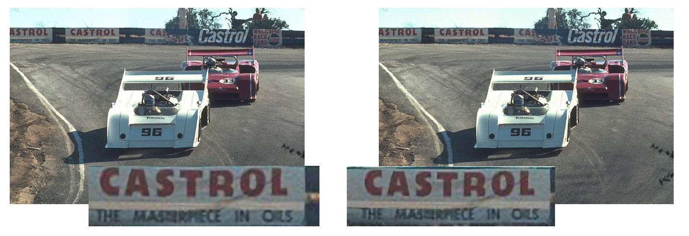
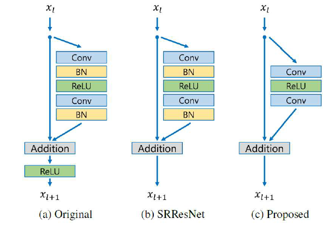
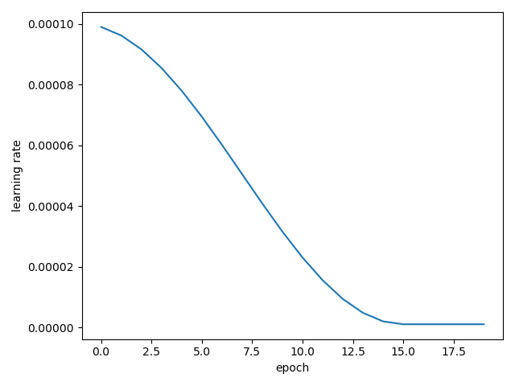
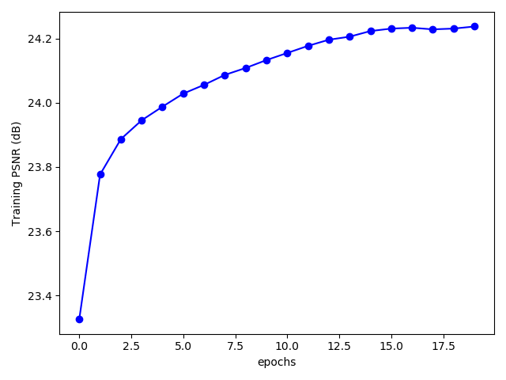
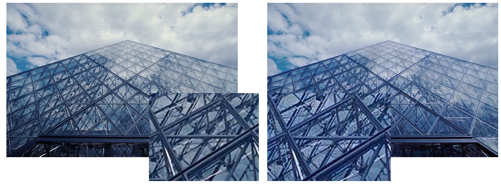
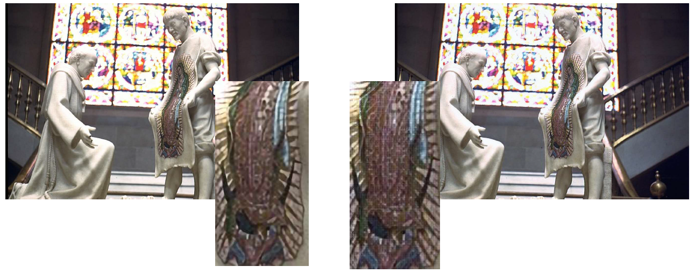

# SRFeat

## Discription
This repository contains my implementation RefSR method proposed in [SRFeat: Single Image Super-Resolution
with Feature Discrimination](http://cg.postech.ac.kr/papers/2018_ECCV_SRFeat.pdf)

### Generator

	

Generator is designed based on SRResNet, which proposed in [SRGAN](https://arxiv.org/pdf/1609.04802.pdf) paper. It is improved version of SRResNet, authors use long-range skip connection for reusing low-level feature of LR image. By this contribution, this network generate good SR result.

This network can be roughly divided into feature extractor and HR image reconstructor. 

1. Feature extractor
   - This part extract important features to reconstruct HR images.
   - This extractor has modules as follows
     -  1 9x9 CNN 
     -  16 Residual Blocks +15 long-range skip connections.(except last block)
2. HR reconstructor
   - Reconstruct HR image by using extracted features.
   - Use PixelShuffler block + 3x3 conv

### Discriminator

	

Disciriminator has typical structure. We should use two kinds of discriminator, image discriminator and feature discriminator.

1. Image Discriminator
   - Input : HR image.
   - Pixel-wise discriminator, same as oridinary discriminator
2. Feature Discriminator
   - Input : Features of HR image
   - Feature-wise discriminator, help to generate realistic features.

### Perceptual loss
Proposed in [Perceptual Losses for Real-Time Style Transfer and Super-Resolution ](https://arxiv.org/pdf/1603.08155) paper

	

To improve perceptual quality of result images, SRFeat use perceptual loss(a.k.a VGG loss). I used VGG_5,4 loss.
This function compare two feature map extracted intermediate layer in pretrained VGG-19 network, we can easily implement this function.

## Implementation

### Dataset

| Dataset name | usage               | link                                                                   |
|--------------|---------------------|------------------------------------------------------------------------|
| COCO2017      | Pre-training |https://cocodataset.org/#download  |
| DIV2K      | Training(with Discriminators)   |https://data.vision.ee.ethz.ch/cvl/DIV2K/1|
|BSD100|Validation| https://www2.eecs.berkeley.edu/Research/Projects/CS/vision/bsds/|
|Set14|Validation|https://cvnote.ddlee.cc/2019/09/22/image-super-resolution-datasets|
|Set5|Validation|https://cvnote.ddlee.cc/2019/09/22/image-super-resolution-datasets|

### Pre-Training

- Dataset 

  - COCO2017 (116620 .jpg files, removed small images)
  - Input size : 296 x 296, center crop

- Batch size : 9

- Epochs : 20 (about 260 thousand iterations)

- Learning rate :

  | epoch<10 | epoch>=10 | epoch>=15 |
  | -------- | --------- | --------- |
  | 1e-4     | 1e-5      | 1e-6      |

- Trained with MSE loss

### GAN Training

- Dataset
  - DIV2K (800 -> 104000, augmented by author's [MATLAB script](https://github.com/HyeongseokSon1/SRFeat/tree/master/data_augmentation))
  - HR : 296x296
  - Upscaling factor : x4
- Batch size : 5
- Epochs : 5 (about 100000 iterations)
- Learning rate:

| epoch<3 | epoch>=3 | epoch=5 |
| ------- | -------- | ------- |
| 1e-4    | 1e-5     | 1e-6    |

- Trained with perceptual loss, Image discriminator, feature discriminator
  - Perceptual loss and Feature discriminator use patch extracted by VGG_(5,4) network
  - Extracted patches scaled by 1/12.75
  - For training generator, disciriminator loss scaled by 1e-3

## Results

### Pre-Training

- Training Curve

    

- Validation PSNR(average)

  | Dataset | BSD100 | Set14 |Set5|
  | ---- | ---- | ---- |----|
  | PSNR(dB) | 25.78 | 26.38 |30.56|

### Train with Discriminator

Left is result of pretrained network, Right is final result.

## Improvement

### Details

	
    

- NotBN block
  - Proposed in "Enhanced Deep Residual Networks for Single Image Super-Resolution"([link](https://openaccess.thecvf.com/content_cvpr_2017_workshops/w12/papers/Lim_Enhanced_Deep_Residual_CVPR_2017_paper.pdf))
  - Remove BN from original Resblock
  - Good for SR task

- Cosine Annealing
  - Learning rate scheduling method
  - Changes the learning rate according to the cosine function.
  - Increase stability of training process

### Result

- Training curve(pretraining)

    

- Validation result

| Dataset  | BSD100 | Set14 | Set5  |
| -------- | ------ | ----- | ----- |
| PSNR(dB) | 25.82  | 26.44 | 30.72 |

- Training with Discriminators

Left images are original SRFeat result, and Right images are improved results.

## References

1. ["SRFeat: Single Image Super-Resolution with Feature Discrimination", ECCV 2018](https://openaccess.thecvf.com/content_ECCV_2018/papers/Seong-Jin_Park_SRFeat_Single_Image_ECCV_2018_paper.pdf)
2. ["Photo-Realistic Single Image Super-Resolution Using a Generative Adversarial Network", CVPR 2017](https://arxiv.org/pdf/1609.04802)
3. ["Enhanced Deep Residual Networks for Single Image Super-Resolution", CVPRW 2017](https://arxiv.org/pdf/1707.02921.pdf)
4. ["SGDR: Stochastic Gradient Descent with Warm Restarts", ICLR 2017](https://arxiv.org/pdf/1608.03983.pdf)
5. ["Real-Time Single Image and Video Super-Resolution Using an Efficient Sub-Pixel Convolutional Neural Network", CVPR 2016](https://arxiv.org/pdf/1609.05158.pdf)
6. ["Perceptual Losses for Real-Time Style Transfer and Super-Resolution", CVPR 2016 ](https://arxiv.org/pdf/1603.08155)